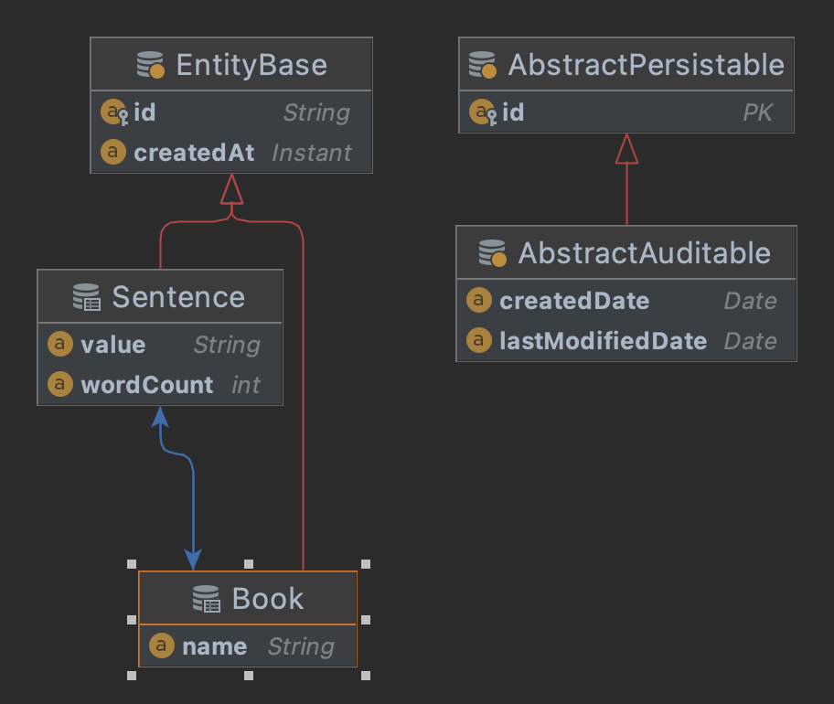

# DOT Backend Developer Interview - Home Assignment

This is a home assignment for candidates for the Digital Onboarding Toolkit Java/Kotlin Developer. We recommend writing it in Kotlin, however if you feel more at home
with Java, you are welcome to write it in it instead.

## Prerequisites
- Java 11 (we recommend [Temurin OpenJDK 11](https://adoptium.net/temurin/releases))

## Entity Model
The entity model is pretty straightforward. We have the `Book` entity which has a list of `Sentence` entities linked to it by the `@OneToMany` relationship (this means that one
book has many sentences). The `Sentence` entity also has its `Book` linked via the `@ManyToOne` relationship as we'd like to retrieve a list of Sentences by the book's ID easily.

The entity classes are already created for you and are generated by Hibernate on startup. The repositories for basic CRUD operations have also been created for you.

### Entity diagram

## Assignment description
Create a RESTful API that provides the following operations:
- Get a word count of a sentence by its ID
- Get a list of sentences grouped by book IDs (return everything in database)
- Insert a book with a list of sentences into the database
- Insert single a sentence into the embedded H2 database

**Keep in mind that:**
- Write operations should **NOT** overwrite existing data
- You should not expose unwanted information to the client
- The client should be decoupled from the server as much as possible

## Criteria for acceptable solution
- Compilable and runnable
- Functional Unit tests
- Cleverly (and sensibly) structured and designed code

## Optional steps
- Integration tests (you can use a framework you are familiar with)
- Documentation
- Anything you can think of to improve the codebase

We'd like you to write the code to the best of your ability and knowledge with sensible design and structure. Good luck.
